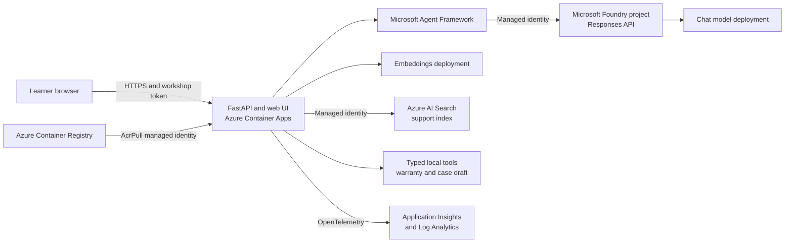

# Architecture

The capstone keeps one agent definition in application code and deploys one container. This makes the AI behavior, API, UI, tests, and deployment artifact version together.

## Request flow

1. The browser sends a bounded message and bearer token to FastAPI.
2. The API resolves or creates a short-lived in-memory conversation.
3. The retrieval layer queries synthetic Markdown locally or Azure AI Search in Azure.
4. Retrieved content is delimited as untrusted reference data.
5. Agent Framework calls the project-scoped Foundry Responses API.
6. The agent can call only the typed tools supplied by the application.
7. The API streams generated text and structured citations as separate server-sent events.
8. OpenTelemetry records operational spans without message content by default.

## Why an ephemeral agent

The agent's instructions and tools ship with the FastAPI application. This is the [ephemeral agent pattern](https://learn.microsoft.com/azure/foundry/agents/quickstarts/responses-api): the application owns the definition while Foundry supplies models, tools, identity, governance, and observability through the project endpoint.

Use a prompt agent when non-developers need to manage a named server-side definition. Use a hosted agent when the agent itself needs a Foundry-managed deployment and agent endpoint.

## Identity

| Caller | Target | Authentication | Minimum purpose |
|--------|--------|----------------|-----------------|
| Local developer | Foundry and Search | `DefaultAzureCredential` | Build, seed, and test |
| Container App | Foundry project | System-assigned managed identity | Invoke models and agents |
| Container App | Search index | System-assigned managed identity | Query documents |
| Container App | ACR | System-assigned managed identity | Pull its image |
| GitHub Actions | Azure | OIDC federated identity | Optional deployment |

Local-auth keys are disabled on Foundry and Search. Production code selects `ManagedIdentityCredential` directly rather than relying on a credential chain.

## Trust boundaries

- User input is untrusted and size constrained.
- Retrieved documents are untrusted even when Search is trusted.
- Generated text is rendered as text, never HTML.
- Citation links accept only HTTP or HTTPS URLs.
- Tools are typed and deterministic.
- The case tool creates a draft only; no external submission capability exists.
- Message and tool content is excluded from telemetry by default.

## Workshop limits

- Conversations are memory-only and limited to one Container App replica.
- The workshop token is a cost-abuse guard, not user identity.
- Public service endpoints reduce setup friction.
- Synthetic records replace customer and ticketing systems.

For production, use Entra user authentication, durable tenant-aware storage, private networking, per-user authorization filters, secrets management, and a reviewed action-confirmation design.

